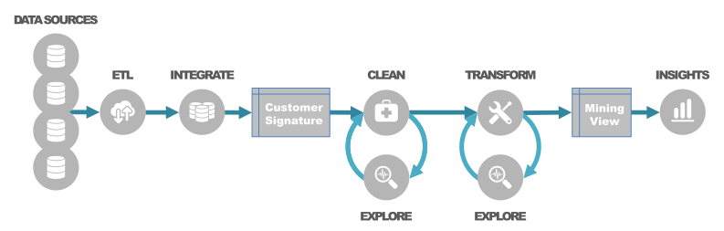
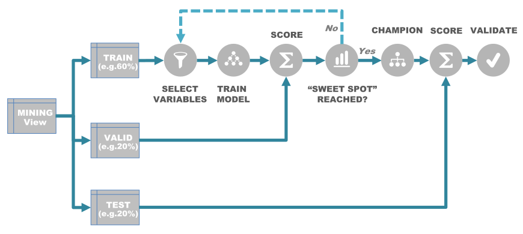

## Credit Scoring Problem
For this project, I would like to demonstrate my abilities working with an imbalanced dataset. This is a domain in data science that has been a subject of research for some time and it crosses over various industries from detecting fraudulent transactions in finance, failure/defect detection in manufacturing to diagnosing rare diseases in healthcare. As of now, there is no clear overall solution as it highly depends on the data and the context of the business problem you are trying to solve.

## Dataset
The dataset belongs to an indian banking company and it is a credit scoring binary classification problem. It contains raw customer financial information from three different data sources and they were split onto 70% training, 30% testing dataset.

1. Account Segment (Customer's historical account and payment behaviour history)
2. Enquiry Segment (Customer's historical enquiry data and enquiry purpose)
3. Demographic data of the customer

This requires me to understand the data and perform data integration from those sources together via data merging and concatenation until it has been compiled to a desired customer signature for further analysis. Features were then generated via transformation as shown by the process below.

Afterwhich, the model was built by first performing variable selection on the training dataset a selecting the top 15 features before they were fed into various machine learning models for training. Logistic Regression, Decision Trees, Random Forest and Gradient Boosting Classifiers were implemented and tested on the testing dataset to determine the best model to accurately predict which customer will default. Finally,lift analysis was used as a metric to evaluate the performance and quality of the best performing model.

